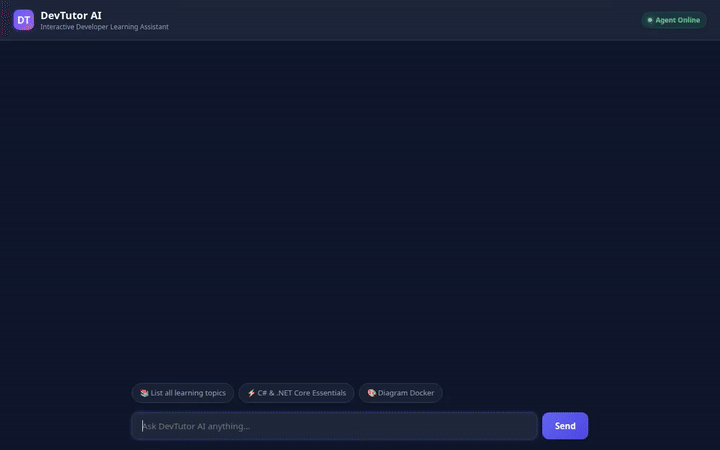

# DevTutor AI — Interactive Developer Learning Assistant

DevTutor AI is a conversational developer tutor agent built with the **Google Agent Development Kit (ADK)** and deployed on **Vertex AI Agent Engine (Agent Runtime)**. It provides personalized developer learning paths, interactive quizzes, visual diagrams, animated video explanations, and safe code execution in a sandbox.



---

## 🌟 Capabilities & Features

### 1. 🧠 Durable Student Memory & Context
- **Vertex AI Memory Bank**: Uses `VertexAiMemoryBankService` to store and recall student preferences, target learning goals, weak concepts, and completed lessons across sessions.
- **Automatic Memory Preloading & Extraction**: Preloads session facts with `PreloadMemoryTool` and extracts key learning achievements after each turn via post-turn callbacks.

### 2. 📚 Educational Content Store (Firestore)
- **Topic & Module Management**: `list_topics`, `get_topic_details`, and `add_topic` query and update learning modules in Firestore.
- **Student Progress Tracking**: `record_student_progress` records mastery scores (0–100%) and topic completion statuses (`in_progress`, `completed`, `needs_review`).
- **Quiz Evaluation**: `evaluate_quiz_answer` compares student responses against topic key concepts and calculates estimated scores.

### 3. 🎨 Rich A2UI Interface
- **Structured UI Components**: Uses `A2uiSchemaManager` (v0.8) and `BasicCatalog` to render structured A2UI cards (Card, Column, Row, Text, Image, Icon) directly in the chat UI.
- **Native Media Rendering**: Renders public diagram images and auto-embeds playable HTML5 video players for animated video explanations.

### 4. 🖼️ Visual Concept Diagram Generation
- **Imagen Generation (`gemini-3.1-flash-lite-image`)**: `generate_concept_diagram` creates technical architecture flowcharts, event loop visualizations, and concept infographics in the `global` region.
- **Dual Output**: Registers artifacts for the ADK Playground and publishes media to a public Google Cloud Storage bucket.

### 5. 🎬 Animated Video Explanations
- **Omni Model Video Generation (`gemini-omni-flash-preview`)**: `generate_topic_video` creates 3-second animated educational videos in the `global` region using the Vertex AI Interactions API.
- **Public Storage Publishing**: Saves artifacts for the Playground and uploads raw video bytes directly to Google Cloud Storage with public HTTPS URLs.

### 6. ⚡ Safe Code Sandbox Execution
- **Agent Engine Sandbox**: Executes student-submitted Python code snippets using `AgentEngineSandboxCodeExecutor` to test output and debug errors safely.

### 7. 🔍 Developer Resources & GitHub Search
- **Documentation Lookup**: `fetch_official_docs` and `fetch_code_cheatsheet` fetch syntax cheat sheets and official framework documentation links.
- **GitHub Repository Search**: `search_github_repositories` searches public open-source starter templates and code repos.

---

## ☁️ Google Cloud & Vertex AI Services Wired Up

- **Vertex AI Agent Engine (Agent Runtime)**: Hosted agent runtime execution with A2A protocol passthrough.
- **Vertex AI Memory Bank**: Long-term state and memory persistence (`us-east1`).
- **Google Cloud Storage (GCS)**: Public media storage bucket for generated concept diagrams and topic videos.
- **Google Cloud Firestore**: NoSQL database for educational topic definitions, user progress, and quiz key concepts.
- **Vertex AI Gemini Models**:
  - `gemini-2.5-flash`: Core reasoning agent model.
  - `gemini-3.1-flash-lite-image`: Technical diagram image generation (`global` region).
  - `gemini-omni-flash-preview`: Animated educational video generation (`global` region).

---

## 🛠️ Planned / Not Yet Implemented

- **Cloud Trace Observability**: Distributed tracing and OpenTelemetry spanning (planned for future release).
- **Interactive Radio Button Quiz Deck Cards**: Interactive A2UI radio button components for inline multiple-choice quizzes.

---

## 📁 Project Structure

```
.
├── app/
│   ├── agent.py            # ADK Root Agent definition, memory callbacks, and A2UI system prompt
│   ├── tools.py            # Firestore tools, GCS media tools, diagram & video generation
│   └── a2ui_utils.py       # A2UI callback transformer
├── frontend/
│   ├── main.py             # Minimal FastAPI proxy communicating with Agent Engine over A2A
│   ├── static/index.html   # Rebranded dark-mode UI with prompt chips & HTML5 video player
│   ├── requirements.txt    # Frontend dependencies
│   └── Dockerfile          # Container configuration for Cloud Run
├── tests/
│   ├── unit/               # Unit test suite
│   └── integration/        # Integration test suite
├── pyproject.toml          # Project configuration & UV environment specs
└── agents-cli-manifest.yaml # Agents-CLI manifest configuration
```

---

## 💻 Local Setup & Development Instructions

### Prerequisites
- Python 3.11+
- `uv` package manager installed
- Google Cloud SDK (`gcloud`) authenticated with Application Default Credentials (`gcloud auth application-default login`)

### 1. Install Dependencies
```bash
uv sync
```

### 2. Run Integration Tests
```bash
GOOGLE_GENAI_USE_VERTEXAI=1 uv run pytest tests/unit tests/integration
```

### 3. Run the Frontend Proxy Locally
Navigate to the `frontend/` directory, set the required environment variables, and start the FastAPI server:

```bash
cd frontend
pip install -r requirements.txt

export AGENT_ENGINE_RESOURCE_NAME="projects/YOUR_PROJECT_ID/locations/us-east1/reasoningEngines/YOUR_REASONING_ENGINE_ID"
export AGENT_DIRECTORY="app"

python main.py
```

The frontend server will start locally and serve the web interface.

---

## 🚀 Deployment Instructions

### Deploy Agent to Vertex AI Agent Runtime
```bash
uv run agents-cli deploy --no-confirm-project
```

### Deploy Frontend Proxy to Cloud Run
```bash
cd frontend
gcloud run deploy devtutor-ai-frontend \
  --source . \
  --region us-east1 \
  --allow-unauthenticated \
  --set-env-vars AGENT_ENGINE_RESOURCE_NAME="projects/YOUR_PROJECT_ID/locations/us-east1/reasoningEngines/YOUR_REASONING_ENGINE_ID",AGENT_DIRECTORY="app"
```
